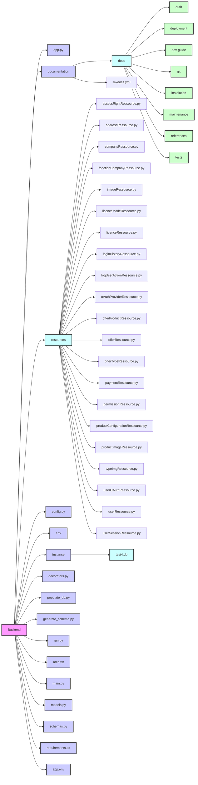

# Tree structure of the application on the backend side

```mermaid
flowchart LR
    style A fill:#f9f,stroke:#333,stroke-width:2px
    style A1 fill:#ccf,stroke:#333,stroke-width:2px
    style A2 fill:#ccf,stroke:#333,stroke-width:2px
    style A3 fill:#ccf,stroke:#333,stroke-width:2px
    style A4 fill:#ccf,stroke:#333,stroke-width:2px
    style A5 fill:#ccf,stroke:#333,stroke-width:2px
    style A6 fill:#ccf,stroke:#333,stroke-width:2px
    style A7 fill:#ccf,stroke:#333,stroke-width:2px
    style A8 fill:#ccf,stroke:#333,stroke-width:2px
    style A9 fill:#ccf,stroke:#333,stroke-width:2px
    style A10 fill:#ccf,stroke:#333,stroke-width:2px
    style A11 fill:#ccf,stroke:#333,stroke-width:2px
    style A12 fill:#ccf,stroke:#333,stroke-width:2px
    style A13 fill:#ccf,stroke:#333,stroke-width:2px
    style A14 fill:#ccf,stroke:#333,stroke-width:2px
    style A15 fill:#ccf,stroke:#333,stroke-width:2px
    style A16 fill:#ccf,stroke:#333,stroke-width:2px
    style A2_1 fill:#cff,stroke:#333,stroke-width:2px
    style A2_1_1 fill:#cfc,stroke:#333,stroke-width:2px
    style A2_1_2 fill:#cfc,stroke:#333,stroke-width:2px
    style A2_1_3 fill:#cfc,stroke:#333,stroke-width:2px
    style A2_1_4 fill:#cfc,stroke:#333,stroke-width:2px
    style A2_1_5 fill:#cfc,stroke:#333,stroke-width:2px
    style A2_1_6 fill:#cfc,stroke:#333,stroke-width:2px
    style A2_1_7 fill:#cfc,stroke:#333,stroke-width:2px
    style A2_1_8 fill:#cfc,stroke:#333,stroke-width:2px
    style A3 fill:#cff,stroke:#333,stroke-width:2px
    style A6_1 fill:#cff,stroke:#333,stroke-width:2px

    A[Backend] --> A1[app.py]
    A --> A2[documentation]
    A --> A3[resources]
    A --> A4[config.py]
    A --> A5[env]
    A --> A6[instance]
    A --> A7[decorators.py]
    A --> A8[populate_db.py]
    A --> A9[generate_schema.py]
    A --> A10[run.py]
    A --> A11[arch.txt]
    A --> A12[main.py]
    A --> A13[models.py]
    A --> A14[schemas.py]
    A --> A15[requirements.txt]
    A --> A16[app.env]

    A2 --> A2_1[docs]
    A2_1 --> A2_1_1[auth]
    A2_1 --> A2_1_2[deployment]
    A2_1 --> A2_1_3[dev-guide]
    A2_1 --> A2_1_4[git]
    A2_1 --> A2_1_5[instalation]
    A2_1 --> A2_1_6[maintenance]
    A2_1 --> A2_1_7[references]
    A2_1 --> A2_1_8[tests]
    A2 --> A2_2[mkdocs.yml]

    A3 --> A3_1[accessRightRessource.py]
    A3 --> A3_2[addressRessource.py]
    A3 --> A3_3[companyRessource.py]
    A3 --> A3_4[fonctionCompanyRessource.py]
    A3 --> A3_5[imageRessource.py]
    A3 --> A3_6[licenceModeRessource.py]
    A3 --> A3_7[licenceRessource.py]
    A3 --> A3_8[loginHistoryRessource.py]
    A3 --> A3_9[logUserActionRessource.py]
    A3 --> A3_10[oAuthProviderRessource.py]
    A3 --> A3_11[offerProductRessource.py]
    A3 --> A3_12[offerRessource.py]
    A3 --> A3_13[offerTypeRessource.py]
    A3 --> A3_14[paymentRessource.py]
    A3 --> A3_15[permissionRessource.py]
    A3 --> A3_16[productConfigurationRessource.py]
    A3 --> A3_17[productImageRessource.py]
    A3 --> A3_18[typeImgRessource.py]
    A3 --> A3_19[userOAuthRessource.py]
    A3 --> A3_20[userRessource.py]
    A3 --> A3_21[userSessionRessource.py]

    A6 --> A6_1[test4.db]


```