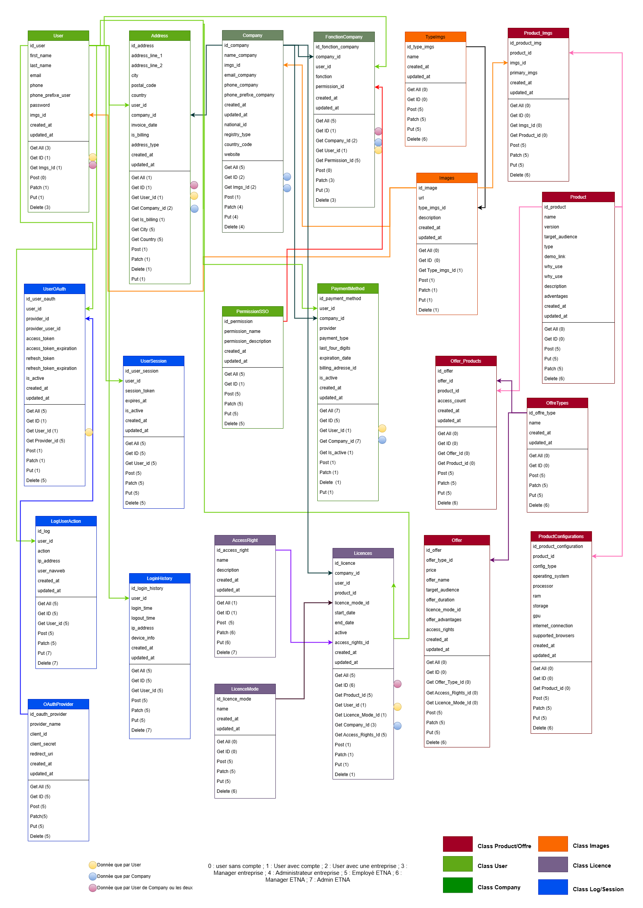

# **Developer Guide**

This guide aims to explain the structure of our SSO project, best development practices, and how to efficiently work with the source code. It also provides information on the application's architecture, file structure, and Git branches to use for development.

## **1. Project Architecture**

The SSO project is organized into multiple components to clearly separate responsibilities between the front-end, back-end, and user management. The architecture follows modular and maintainable development principles. Below is an overview of the different modules and their roles:

### **Project Modules:**

- **Back-End (Flask)**: Handles authentication, business logic, and data management. Uses Flask for the REST API.
- **Front-End (e.g., React)**: User interface allowing users to log in, manage their accounts, and navigate the application.
- **Database**: Stores user information, sessions, permissions, etc. Uses SQLAlchemy for data model management on the back-end.
- **User Management**: Manages roles, permissions, and user sessions.
- **Security and OAuth**: Manages authentication via OAuth and other security mechanisms.

## **2. Project Folder Structure**

The project's directory structure is designed to be clear and maintainable. Each part of the project (back-end, front-end) has its own workspace.

### **2.1 Back-End Directory Structure**
```graphql
SSO-Project
│
├── Backend/
│   ├── app.py               # Application entry point for Flask
│   ├── config.py            # Configuration for variables and environment
│   ├── resources/           # API routes and resource definitions
│   ├── models.py            # SQLAlchemy data models
│   ├── schemas.py           # Marshmallow schemas for validation
│   ├── utils.py             # Utility functions for the application
│   ├── requirements.txt     # List of Python dependencies
│   └── app.env              # Environment variables for Flask
│
└── migrations/              # Folder for database migrations
```

## **3. API Class Diagram**



