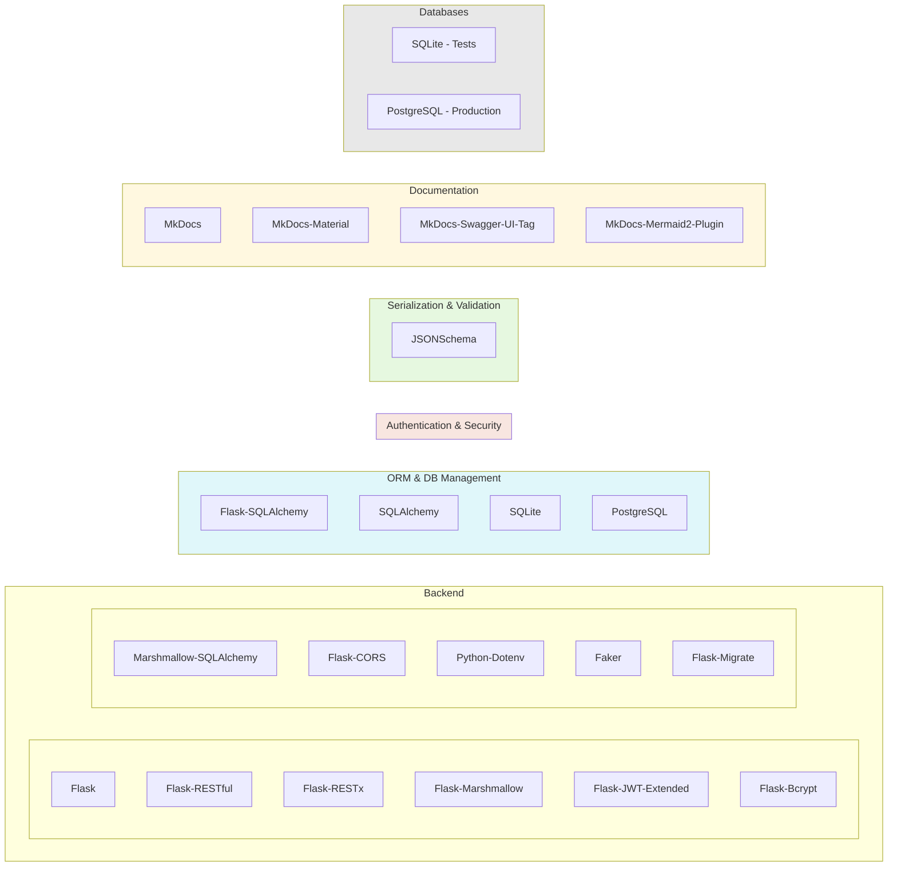

Voici la traduction en anglais :  

---

# **Chosen Technologies**  

## **Schema**  

## **Backend Technologies**  

### Flask  
Flask is a micro web framework for Python, used to create lightweight and modular web applications. It allows defining routes, handling HTTP requests, and easily integrating third-party libraries like the ones you are using. It is a flexible, lightweight, and scalable framework, ideal for RESTful APIs.  

### Flask-SQLAlchemy  
Flask-SQLAlchemy is an extension of Flask that simplifies the integration of SQLAlchemy (an ORM) with Flask. It helps manage data models, entity relationships, and execute SQL queries more cleanly and Pythonically. SQLAlchemy provides a bridge between Python code and a relational database.  

- **Advantages**:  
  - Powerful ORM for managing objects and relationships.  
  - Automatic transaction management and database migrations.  
  - Flexible, with full control over SQL queries if needed.  

### Flask-RESTful  
Flask-RESTful is an extension for Flask that simplifies the creation of RESTful APIs. It makes it easier to handle HTTP requests (GET, POST, PUT, DELETE), manage resources, and serialize responses in JSON.  

- **Advantages**:  
  - Simplifies the creation of REST APIs.  
  - Seamless integration with Flask and support for HTTP methods.  
  - Automatic error handling and response management.  

### Flask-RESTx  
Flask-RESTx is an extended version of Flask-RESTful that offers additional features such as automatic API documentation, Swagger support, and data validation. It is ideal for building robust and well-documented APIs.  

- **Advantages**:  
  - Automatic documentation via Swagger UI.  
  - Schema validation and request data validation.  
  - Support for asynchronous requests (useful for modern APIs).  

### Flask-Marshmallow  
Flask-Marshmallow is a Flask extension that integrates Marshmallow for serialization and data validation. Marshmallow converts Python objects to JSON formats and vice versa while validating data against a predefined schema.  

- **Advantages**:  
  - Serialization and deserialization of Python objects.  
  - Input and output data validation.  
  - Support for object relationships.  

### Marshmallow-SQLAlchemy  
This Marshmallow extension is used to serialize and validate SQLAlchemy models. It converts SQLAlchemy objects to JSON and validates data based on SQLAlchemy models.  

- **Advantages**:  
  - Easy serialization and validation of SQLAlchemy objects.  
  - Manages relationships between SQLAlchemy models seamlessly.  

### JSONSchema  
JSONSchema is a standard for defining the structure of JSON data. It is used here to validate the structure of JSON objects received or sent by the API, ensuring that data follows the expected format before processing.  

- **Advantages**:  
  - Precise validation of JSON structure.  
  - Ensures that inputs conform to an expected format.  
  - Useful for documenting and testing APIs.  

### Flask-JWT-Extended  
Flask-JWT-Extended is a Flask extension for handling authentication with JSON Web Tokens (JWT). It secures the API by requiring a valid token to access certain resources.  

- **Advantages**:  
  - Easy JWT token management for securing the API.  
  - Supports role-based access and JWT-based permissions.  
  - Simple integration with Flask routes.  

### Flask-Bcrypt  
Flask-Bcrypt is a Flask extension for securely hashing passwords using the Bcrypt algorithm. It protects user passwords effectively.  

- **Advantages**:  
  - Secure password hashing.  
  - Protection against dictionary and brute-force attacks.  
  - Simple integration with Flask.  

### Flask-CORS  
Flask-CORS allows managing Cross-Origin Resource Sharing (CORS) permissions. This enables your API to accept requests from different domains, which is essential for separate front-end applications.  

- **Advantages**:  
  - Easy management of cross-origin requests.  
  - Secure communication between backend and frontend.  
  - Flexible CORS header configuration.  

### Python-Dotenv  
Python-Dotenv is a library that loads environment variables from a `.env` file into the Flask application. This makes it easier to manage configurations (such as API keys, database settings, etc.) securely.  

- **Advantages**:  
  - Easily loads environment variables.  
  - Separates configuration from source code for better security.  
  - Allows using the same environment variables across different environments (dev, prod, etc.).  

### Faker  
Faker is a library for generating fake data. It is used to create test data such as user names, addresses, emails, etc., for development or testing purposes.  

- **Advantages**:  
  - Fast and easy test data generation.  
  - Customizable generated data.  
  - Ideal for load testing or populating databases with realistic data.  

### Flask-Migrate  
Flask-Migrate is an extension for managing database migrations with Alembic. It simplifies applying database modifications (creating tables, adding columns, etc.) and keeps the database structure synchronized with SQLAlchemy models.  

- **Advantages**:  
  - Smooth database migration management.  
  - Tracks database modifications history.  
  - Easy implementation of new data structures.  

---

## 2. **Database**  

### SQLite  
SQLite is a lightweight database, mainly used for local development and testing. It is fully integrated into Python code without requiring a separate database server installation. It is ideal for small projects or tests where performance is not a critical factor.  

- **Advantages**:  
  - Easy to install and configure.  
  - No need for an external server to function.  
  - Ideal for testing or small applications.  

### PostgreSQL (for production)  
PostgreSQL is a more robust and high-performance relational database, often used for production applications. It offers advanced features like transactions, views, and indexes and is suited for more complex, large-scale applications.  

- **Advantages**:  
  - High performance and scalability.  
  - Support for complex transactions and advanced SQL queries.  
  - Reliability and security for production applications.  
  - Support for advanced data types (JSON, XML, etc.).  

We can adapt our database configuration to switch from SQLite to PostgreSQL depending on the environment (dev vs. production or test vs. production). The `flask-sqlalchemy` library allows for an easy transition between database types.  

To facilitate quick database population, a CLI function enables rapid database filling based on the model. If there is a model structure change, remember to update it to ensure the population process remains accurate.  

### 3. **Documentation**  

#### MkDocs  
MkDocs is a static site generator for project documentation. It allows you to create online documentation in the form of a website, often used for APIs, project specifications, and more.  

- **Advantages**:  
  - Easy to use and configure.  
  - Automatically generates documentation websites from Markdown files.  
  - Supports themes and plugins to customize the appearance.  

#### MkDocs-Material  
MkDocs-Material is a theme for MkDocs that provides a modern and responsive interface for documentation. It is widely used for creating visually appealing and easy-to-navigate documentation sites.  

#### MkDocs-Swagger-UI-Tag  
This MkDocs plugin allows you to integrate API documentation generated by Swagger UI directly into MkDocs. It provides an interactive interface to explore and test REST APIs.  

#### MkDocs-Mermaid2-Plugin  
The MkDocs-Mermaid2 plugin enables the addition of Mermaid diagrams to MkDocs documentation. Mermaid is a diagramming language used to generate flowcharts, sequence diagrams, and other visualizations directly from text files.  

---  

### Conclusion  

With all these technologies, your Flask back-end is well-equipped to create a secure, well-structured, and easy-to-maintain API. By using Flask, Flask-SQLAlchemy, Flask-RESTful, and other extensions, you benefit from a solid framework for managing users, authentication, data, and documentation. Switching to PostgreSQL for production while using SQLite for testing is a robust strategy to maintain performance across different environments.  
