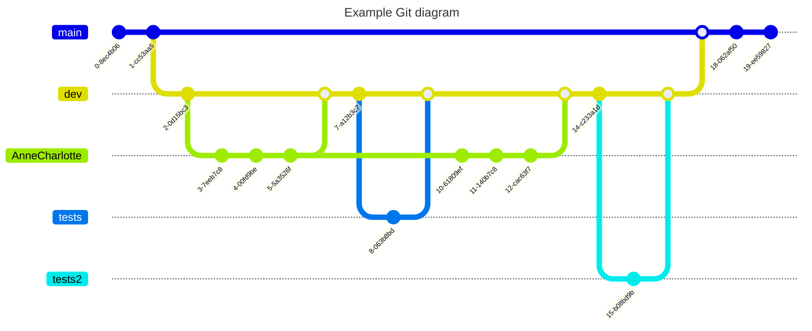

### **Git Guide for New Collaborators**  

## **Introduction**  

This document aims to explain the Git branch architecture of our project and detail the essential commands to work efficiently with Git.  

## **Branch Architecture**  

We use an organized Git structure as follows:  

- **master**: The main, stable branch, always ready for production.  
- **dev**: The development branch where new features are integrated before moving to production.  
- **AnneCharlotte**: Example of a developer's branch where features are worked on before merging into `dev`.  
- **test-ui**: A branch dedicated to user interface testing.  


## **Essential Commands**  

### **1. Clone the project**  
```bash
git clone https://github.com/my-project.git
cd ETNA-Access
```  

### **2. Create and push a new branch**  
```bash
git checkout -b "my_new_branch" dev
```  
After adding/modifying files:  
```bash
git add .
git commit -m "New Features"
git push -u origin my-dev-branch
```  

### **3. Update branches from master**  

Update `dev` from `master`:  
```bash
git checkout dev
git pull origin master
git push origin dev
```  
Update `AnneCharlotte` from `dev`:  
```bash
git checkout AnneCharlotte
git pull origin dev
git push origin AnneCharlotte
```  
Update `test-ui` from `master` or `dev`:  
```bash
git checkout test-ui
git pull origin master  # or dev depending on the need
git push origin test-ui
```  

### **4. Merge a branch into dev**  

From `dev`, merge a branch and push the changes:  
```bash
git checkout dev
git merge my-dev-branch
git push origin dev
```  

### **5. Retrieve the latest updates**  
```bash
git pull origin master
```  

### **6. Handle merge conflicts**  

If a conflict occurs after a merge or pull:  

Git will indicate which files are in conflict.  

Open the affected files and resolve the conflicts.  

Once resolved:  
```bash
git add .
git commit -m "Conflict resolution"
git push
```  

## **Example Git Workflow**  



## **Best Practices**  

### **Write Clear Commit Messages**  
When writing commit messages, be precise and concise about what has changed. Here is a recommended format:  

```bash
[TYPE]: Brief description of the change

Example:
[FIX]: Fixed authentication bug for users
```  

### **Follow Code Conventions**  
Follow the coding conventions defined for the project (e.g., PEP8 for Python and ESLint for JavaScript). This ensures code readability and consistency across collaborators.  

### **Testing and Validation**  
Before merging your changes into `dev`, ensure your modifications have been tested and validated. For UI testing, use tools like Jest or Cypress to test React components.  

## **Conclusion**  

With this structure, we ensure an organized development process and seamless integration of new features. If you have any questions, feel free to ask!  